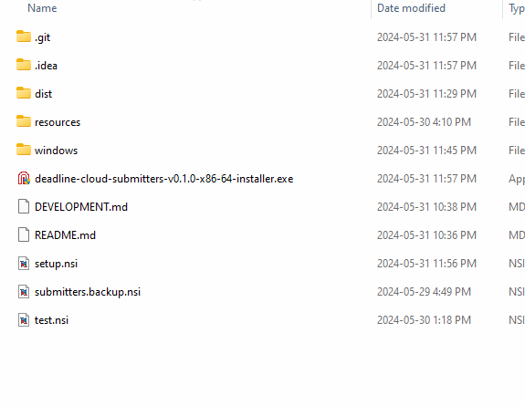

# Deadline Cloud Installers

This installer system uses NSIS to build Windows installers, makeself on Linux, and pkgbuild on MacOS.

## Windows
We are using the [Large strings](https://nsis.sourceforge.io/Special_Builds#Large_strings) build of NSIS so that our "Installation Overview" text can be fully included.

# Demo
 